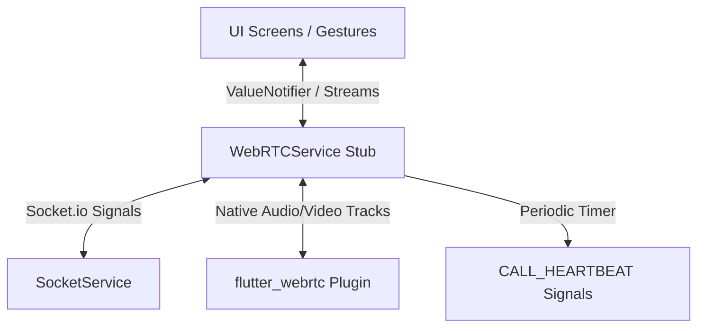

# Kiến Trúc & Thiết Kế Tính Năng Gọi 1-1 và Gọi Nhóm (WebRTC & Socket.io)

Tài liệu này cung cấp cái nhìn chi tiết và toàn diện về cơ chế hoạt động, kiến trúc luồng dữ liệu, và cách xử lý kỹ thuật của tính năng **Gọi 1-1 (Direct Call)** và **Gọi nhóm (Group Call)** trên cả hai đầu: **Backend (API NestJS)** và **Frontend (React Web-App)**.

---

## 1. Tổng Quan Kiến Trúc (Architecture Overview)

Hệ thống cuộc gọi được thiết kế dưới dạng kết hợp giữa **Tín hiệu thời gian thực (Real-time Signaling)** thông qua **Socket.io** và **Truyền dẫn truyền thông ngang hàng (Peer-to-Peer Media Transport)** thông qua **WebRTC**.

### 1.1. Sơ đồ luồng hoạt động tổng quát

```mermaid
sequenceDiagram
    autonumber
    actor Alice as Người gọi (Caller)
    participant Server as Gateway (Socket.io & Redis)
    actor Bob as Người nhận (Callee)

    Alice->>Server: CALL_INIT (Gửi tín hiệu cuộc gọi kèm loại video/voice)
    Server-->>Server: Tạo/Cập nhật Call Session trong Redis (Status: RINGING)
    Server->>Bob: CALL_INIT (Chuyển tiếp tín hiệu đổ chuông)
    Note over Bob: Giao diện hiển thị Modal Cuộc gọi đến (INCOMING)
    
    Bob->>Server: CALL_ACCEPT (Chấp nhận cuộc gọi)
    Server-->>Server: Cập nhật Call Session trong Redis (Status: ACTIVE)
    Server->>Alice: CALL_ACCEPT (Phản hồi chấp nhận)
    
    Note over Alice, Bob: Bắt đầu thiết lập WebRTC PeerConnection
    Alice->>Server: WEBRTC_OFFER (Gửi Offer SDP)
    Server->>Bob: WEBRTC_OFFER (Chuyển tiếp Offer)
    Bob->>Server: WEBRTC_ANSWER (Gửi Answer SDP)
    Server->>Alice: WEBRTC_ANSWER (Chuyển tiếp Answer)
    
    rect rgb(15, 23, 42)
        Note over Alice, Bob: Trao đổi ICE Candidates qua socket & thiết lập kết nối trực tiếp P2P
        Alice<->>Bob: Kết nối P2P thành công (Bắt đầu Stream Voice/Video)
    end

    loop Mỗi 5 giây
        Alice->>Server: CALL_HEARTBEAT (Giữ kết nối session)
        Bob->>Server: CALL_HEARTBEAT (Giữ kết nối session)
    end
```

---

## 2. Thiết Kế & Xử Lý ở Backend (`apps/api`)

Backend được viết trên nền tảng **NestJS**, sử dụng **Socket.io Gateway** làm Server trung gian điều tuyến và **Redis** để lưu trữ trạng thái phiên cuộc gọi (Call Session).

### 2.1. Quản lý Phiên cuộc gọi (Call Session Management)
Mọi cuộc gọi được quản lý thông qua lớp nghiệp vụ `ChatCallSessionService` (`chat-call-session.service.ts`). Trạng thái một phiên cuộc gọi (`ChatCallSession`) bao gồm:
*   `status`: Trạng thái cuộc gọi (`'RINGING'` - Đang đổ chuông hoặc `'ACTIVE'` - Đang kết nối).
*   `initiatedByUserId`: ID người khởi tạo cuộc gọi.
*   `participantUserIds`: Danh sách tất cả ID người dùng có quyền tham gia.
*   `acceptedByUserIds`: Danh sách ID người dùng đã chấp nhận tham gia cuộc gọi.
*   `rejectedByUserIds`: Danh sách ID người dùng đã từ chối.
*   `endedByUserIds`: Danh sách ID người dùng đã chủ động cúp máy.
*   `isVideo`: Xác định cuộc gọi có hình (Video Call) hay chỉ tiếng (Voice Call).
*   `isGroup`: Phân biệt cuộc gọi 1-1 hay cuộc gọi nhóm.

#### Lưu trữ dữ liệu & Đồng bộ phân tán:
*   Hệ thống sử dụng **Redis** làm kho lưu trữ phân tán để lưu phiên với khóa cấu trúc: `${prefix}:chat:call-session:${conversationKey}`.
*   Nếu không kết nối được Redis, hệ thống tự động rơi về cơ chế lưu trữ cục bộ trong bộ nhớ RAM (`memorySessions: Map<string, MemoryChatCallSessionEntry>`).
*   **Thời gian tồn tại (TTL):**
    *   *Trạng thái RINGING:* Giới hạn thời gian đổ chuông qua tham số `chatCallInviteTtlSeconds` (Mặc định thường là 45s).
    *   *Trạng thái ACTIVE:* Kéo dài thời gian tồn tại qua tham số `chatCallActiveTtlSeconds`. Trạng thái này liên tục được cập nhật lại TTL (Touch) khi nhận được tín hiệu Heartbeat từ client.

### 2.2. Các Event Socket & Nghiệp vụ Xử lý (`ConversationsGateway`)

Backend đăng ký các WebSocket handlers trong `conversations.gateway.ts` để tiếp nhận các hành động:

#### 1. Khởi tạo cuộc gọi (`CALL_INIT`)
*   Kiểm tra quyền truy cập hội thoại thông qua `resolveConversationAccess`.
*   Kiểm tra nếu đã tồn tại cuộc gọi đang hoạt động:
    *   **Với cuộc gọi 1-1:** Nếu có cuộc gọi khác đang chạy, trả về lỗi `ConflictException` ("Another call is already active").
    *   **Với cuộc gọi nhóm:** Trả về lỗi `ConflictException`. Tuy nhiên, phía client sẽ hứng lỗi này để thực hiện logic tự động gia nhập cuộc gọi nhóm hiện tại thay vì khởi tạo mới.
*   Lưu phiên mới vào Redis với trạng thái `RINGING` và phát tín hiệu `CALL_INIT` đến tất cả thành viên trong nhóm hoặc đối phương (ngoại trừ người gọi).

#### 2. Chấp nhận cuộc gọi (`CALL_ACCEPT`)
*   Xác thực người dùng là thành viên hợp lệ trong cuộc gọi.
*   Chuyển trạng thái phiên sang `ACTIVE`.
*   Thêm ID người dùng vào mảng `acceptedByUserIds`.
*   Phát tín hiệu `CALL_ACCEPT` ra toàn hội thoại để thông báo thiết lập luồng WebRTC.
*   *Lưu ý bảo mật cuộc gọi 1-1:* Caller không thể tự chấp nhận cuộc gọi của chính mình (Ném ra `BadRequestException`).

#### 3. Từ chối cuộc gọi (`CALL_REJECT`)
*   **Với cuộc gọi 1-1:** Xóa phiên cuộc gọi khỏi Redis ngay lập tức và phát tín hiệu `CALL_REJECT` để đầu bên kia tự tắt giao diện đổ chuông.
*   **Với cuộc gọi nhóm:** Chỉ thêm ID người từ chối vào danh sách `rejectedByUserIds` để loại bỏ khỏi luồng định tuyến tín hiệu WebRTC, giữ nguyên cuộc gọi cho các thành viên khác.
*   Tự động lưu một tin nhắn hệ thống (System Message) vào cơ sở dữ liệu: *"Voice/Video call was rejected."*

#### 4. Kết thúc cuộc gọi (`CALL_END`)
*   **Với cuộc gọi 1-1:** Xóa phiên khỏi Redis ngay lập tức, phát tín hiệu `CALL_END` đến đối phương và ghi log thời lượng cuộc gọi dưới dạng tin nhắn hệ thống: *"Video call ended (02:15)."*
*   **Với cuộc gọi nhóm:**
    *   Loại bỏ người dùng khỏi `acceptedByUserIds` và đưa vào danh sách `endedByUserIds`.
    *   **Logic Tối Ưu Mới:** Nếu số lượng thành viên đàm thoại còn lại nhỏ hơn hoặc bằng 1 (chỉ còn 1 người duy nhất trong cuộc gọi nhóm), cuộc gọi sẽ tự động được chấm dứt vì cuộc gọi nhóm yêu cầu tối thiểu 2 người đàm thoại:
        1. **Ở phía Backend:** Xóa phiên cuộc gọi (`Call Session`) khỏi Redis ngay lập tức.
        2. **Ở phía Client (Flutter/Web-App):** Tự động phát hiện khi danh sách Peer rỗng (`_peerConnections.isEmpty`), giải phóng camera/micro cục bộ, phát đi tín hiệu kết thúc cuộc gọi (`stopCall(emitSignal: true)`), và đưa người dùng quay về màn hình Chat chi tiết (`ChatDetailScreen`).
    *   Nếu vẫn còn ít nhất 2 thành viên khác đang đàm thoại, cuộc gọi tiếp tục duy trì. Client phát tín hiệu ngắt kết nối riêng tới Peer của thành viên vừa rời đi. Đồng thời lưu tin nhắn hệ thống: *"X left the call."*

#### 5. Duy trì kết nối (`CALL_HEARTBEAT`)
*   Định kỳ nhận gói tin từ client để gia hạn thời gian sống (TTL) của session trên Redis, ngăn việc session bị hết hạn tự động do sự cố gián đoạn mạng đột ngột.

### 2.3. Quy tắc Định tuyến Tín hiệu WebRTC
Tất cả các gói tin tín hiệu WebRTC gồm `WEBRTC_OFFER`, `WEBRTC_ANSWER`, và `WEBRTC_ICE_CANDIDATE` đều đi qua hàm dùng chung `forwardWebRtcSignal`:
*   Sử dụng phương thức `listMediaRecipientUserIds` để lọc danh sách các thành viên sẽ nhận được tín hiệu.
    *   **Với cuộc gọi 1-1:** Trả về ID của thành viên đối phương.
    *   **Với cuộc gọi nhóm:** **Chỉ trả về danh sách các thành viên có ID nằm trong `acceptedByUserIds`** (và loại trừ chính người gửi). Điều này đảm bảo các luồng tín hiệu WebRTC chỉ được trao đổi giữa những thành viên đã thực sự chấp nhận tham gia, tránh gửi thừa tín hiệu cho các máy đang đổ chuông hoặc đã từ chối.
*   Gắn thêm dữ liệu định tuyến `senderId` và `targetId` vào payload tín hiệu trước khi gửi để hỗ trợ client định tuyến chính xác trong lưới mạng.

---

## 3. Thiết Kế & Xử Lý ở Frontend (`apps/web-app`)

Frontend quản lý trạng thái kết nối WebRTC và giao diện cuộc gọi thông qua hook React tùy biến `useWebRTC` (`useWebRTC.ts`) và giao diện hiển thị `CallModal` (`CallModal.tsx`).

### 3.1. Hook Quản Lý Kết Nối `useWebRTC.ts`

Hook quản lý 5 trạng thái vòng đời cuộc gọi (`CallState`):
1.  `IDLE`: Không có cuộc gọi.
2.  `CALLING`: Đang gọi đi (Đợi đối phương nhấc máy).
3.  `INCOMING`: Đang có cuộc gọi đến (Đổ chuông).
4.  `CONNECTING`: Đang thực hiện bắt tay tín hiệu WebRTC.
5.  `CONNECTED`: Đã kết nối WebRTC thành công và đang truyền tải media.

#### 1. Quản lý Mạng lưới Kết nối (Mesh Topology cho Cuộc gọi nhóm)
Khác với mô hình tập trung sử dụng SFU/MCU đắt đỏ, hệ thống sử dụng **Full Mesh Topology**:
*   Mỗi máy khách trong cuộc gọi nhóm sẽ tạo và duy trì các kết nối trực tiếp độc lập (`RTCPeerConnection`) đến tất cả các thành viên khác đang đàm thoại.
*   Mạng lưới Peer được lưu trữ và quản lý trong một `Map` lưu trữ ở React Ref: `peerConnectionsRef = useRef<Map<string, RTCPeerConnection>>(new Map())`.

#### 2. Thuật toán Giải quyết Tranh chấp Tín hiệu (Polite & Impolite Peers)
Trong môi trường Full Mesh, việc hai thành viên cùng lúc cố gắng tạo và gửi WebRTC `Offer` cho nhau (gọi là hiện tượng Glare) là rất phổ biến. Để xử lý triệt để, hệ thống áp dụng cơ chế phân định dựa trên so sánh Lexicographical của ID người dùng:
*   Mỗi khi phát hiện có thành viên mới gia nhập, hệ thống so sánh:
    ```typescript
    const amIHigherId = (user?.sub || "") > peerId;
    ```
*   **Nếu `amIHigherId === true` (Impolite/Active Peer - Chủ động):** Thiết bị của bạn đóng vai trò khởi xướng, tự động tạo WebRTC `Offer` gửi tới đối phương.
*   **Nếu `amIHigherId === false` (Polite/Passive Peer - Lắng nghe):** Thiết bị sẽ chuyển sang chế độ đợi nhận `Offer` từ đối phương. Khi nhận được `Offer`, nó sẽ sinh ra và gửi lại WebRTC `Answer`.
*   Cơ chế này loại bỏ hoàn toàn xung đột trạng thái thiết lập kênh truyền thông WebRTC (Signaling State Glare).

#### 3. Cấu hình Máy chủ Bắt tay NAT (STUN/TURN Servers)
Để kết nối P2P xuyên qua các lớp tường lửa và NAT của nhà mạng di động hoặc mạng doanh nghiệp, hệ thống định hình danh sách máy chủ ICE (`getIceServers`):
*   **STUN Servers:** Mặc định sử dụng các máy chủ miễn phí của Google (`stun:stun.l.google.com:19302`).
*   **TURN Servers:** Tích hợp dịch vụ TURN từ **Metered.ca** qua biến môi trường `VITE_TURN_USERNAME` và `VITE_TURN_PASSWORD`. TURN là bắt buộc đối với Symmetric NAT (truy cập bằng 4G/5G hoặc mạng công sở chặn nhiều cổng).

#### 4. Cơ chế Đệm và Tránh Quá tải ICE (ICE Candidate Queuing & Throttling)
Để bảo vệ Socket Server khỏi bị tràn băng thông hoặc bị block rate-limit khi trao đổi hàng loạt ICE candidates trong cuộc gọi nhóm, client áp dụng các thuật toán tối ưu sau:
*   **Candidate Deduplication:** Sử dụng một `Set` (`sentIceCandidateKeysRef`) lưu trữ hàm băm của các ICE candidate đã gửi nhằm ngăn chặn việc gửi lặp lại các candidate trùng lặp.
*   **Throttling Queue:** Các candidate được đưa vào hàng đợi `pendingIceSignalsRef` và được đẩy đi cách nhau định kỳ 120ms bằng bộ định thời `flushQueuedIceSignals` thay vì phát dồn dập cùng lúc. Cập nhật tối đa 100 candidate cho mỗi cuộc gọi để tránh tràn bộ nhớ.
*   **Early Signal Queuing:** Nếu nhận được các ICE Candidate từ đối phương trước khi máy hoàn tất thiết lập cấu hình mô tả cấu hình mạng từ xa (`pc.remoteDescription`), các candidate này sẽ được đưa vào `pendingIceCandidatesRef` và chỉ được áp dụng (`addIceCandidate`) ngay sau khi remote description được thiết lập thành công.

#### 5. Điều khiển Thiết bị Media nội bộ (Local Media Fallback)
*   Yêu cầu Micro và Camera thông qua `navigator.mediaDevices.getUserMedia`.
*   **Cơ chế fallback tự động:** Nếu yêu cầu luồng Video thất bại (do người dùng từ chối quyền camera hoặc thiết bị không có camera), hệ thống tự động bắt lỗi và thử lại bằng cách chỉ yêu cầu luồng Audio-only. Tránh việc cuộc gọi bị ngắt hoàn toàn chỉ vì thiếu phần cứng camera.
*   Hỗ trợ đàm thoại đa phương thức: Người dùng có thể bật/tắt camera/micro linh hoạt giữa cuộc gọi thông qua phương thức `toggleMute` và `toggleVideo`.

---

### 3.2. Thành phần Giao diện `CallModal.tsx`

`CallModal` hiển thị dưới dạng một hộp thoại tiện ích nổi thông minh với các đặc tính cao cấp:

#### 1. Kéo thả tự do (Draggable Floating Modal)
*   Sử dụng các sự kiện con trỏ Pointer Events (`onPointerDown`, `pointermove`, `pointerup`) để tính toán vị trí tọa độ của chuột/ngón tay.
*   Cập nhật tọa độ modal qua state `dragPosition`, cho phép người dùng kéo thả hộp thoại cuộc gọi đến bất kỳ góc nào trên màn hình, giúp họ vừa gọi điện vừa có thể đọc tin nhắn hoặc thao tác các tính năng khác trên hệ thống.

#### 2. Bố cục dạng lưới động (Dynamic Grid Layout & Trình bày)
*   Nếu là cuộc gọi 1-1, giao diện hiển thị video đối phương tràn màn hình, video của bạn thu nhỏ ở góc dưới bên phải.
*   Nếu là cuộc gọi nhóm lớn, giao diện tự động chia tỷ lệ hiển thị dạng Grid (1x1, 2x2, 3x3...) dựa trên tổng số luồng video đang kết nối (`totalVideos`).

#### 3. Thuật toán Nhận diện giọng nói (Speaking Detection)
Để tăng tính tương tác sinh động, hệ thống tích hợp bộ xử lý âm thanh thời gian thực ngay tại trình duyệt thông qua **Web Audio API** tích hợp trong component `<RemotePeerVideo>`:
*   Khởi tạo `AudioContext` kết hợp với `AnalyserNode` (`fftSize = 256`, hệ số làm mượt `smoothingTimeConstant = 0.78`).
*   Tạo nguồn âm thanh kết nối trực tiếp từ luồng stream của peer: `audioContext.createMediaStreamSource(stream)`.
*   Sử dụng `requestAnimationFrame` lặp liên tục để đọc dữ liệu tần số âm thanh bằng `analyser.getByteFrequencyData()`.
*   Tính toán mức độ decibel trung bình:
    ```typescript
    const total = data.reduce((sum, value) => sum + value, 0);
    const average = total / data.length;
    const isSpeaking = average > 16;
    ```
*   **Debounce trạng thái nói:** Để tránh việc viền sáng nhấp nháy liên tục khi người dùng ngắt quãng từ ngữ ngắn, hệ thống áp dụng cơ chế trễ: khi bắt đầu nói thì phản hồi nhanh (250ms), khi dừng nói thì giữ trạng thái sáng lâu hơn một chút (700ms) rồi mới tắt.
*   **Hiển thị trực quan:** Khi thành viên đang nói, giao diện của họ sẽ tự động được làm nổi bật bằng một **đường viền phát sáng màu xanh lá (`ring-2 ring-emerald-400`)** và avatar cũng được tạo hiệu ứng viền phát sáng tương ứng.
*   **Ưu tiên hiển thị (Speaking Prioritization):** Trong chế độ Grid của cuộc gọi nhóm, danh sách các thành viên được tự động sắp xếp lại (`orderedRemoteEntries`) sao cho **những người đang phát biểu sẽ được đưa lên đầu danh sách (góc trên cùng bên trái)** để mọi người dễ dàng chú ý theo dõi.

---

## 4. Bảng So Sánh Kỹ Thuật: Gọi 1-1 vs Gọi Nhóm

| Đặc tính kĩ thuật | Gọi 1-1 (Direct Call) | Gọi Nhóm (Group Call) |
| :--- | :--- | :--- |
| **Kiến trúc WebRTC** | P2P PeerConnection đơn lẻ. | Full Mesh (Nhiều PeerConnection song song). |
| **Lựa chọn Offer Creator** | Người khởi tạo cuộc gọi (Caller) luôn là người tạo Offer. | Sử dụng thuật toán so sánh User ID để phân định Polite/Impolite Peer. |
| **Định tuyến tín hiệu** | Chuyển tiếp trực tiếp cho đối phương. | Định tuyến chính xác thông qua đính kèm `senderId` và `targetId` trong payload. |
| **Quản lý Session trên BE** | Xóa hoàn toàn phiên khi một trong hai người từ chối hoặc kết thúc cuộc gọi. | Chỉ xóa phiên khi số lượng thành viên đang kết nối (`acceptedByUserIds`) bằng 0. |
| **Giao diện hiển thị** | Người dùng đối diện chiếm toàn màn hình, camera local thu nhỏ ở góc. | Bố cục lưới Grid động tự co giãn, tự động đưa người đang nói lên vị trí ưu tiên. |
| **Hành vi trùng cuộc gọi** | Báo bận (`ConflictException`) và cấm khởi tạo. | Cho phép tự động tham gia (`CALL_ACCEPT`) vào cuộc gọi nhóm đang diễn ra. |
| **Định tuyến WebRTC ở BE** | Gửi thẳng cho người còn lại. | Chỉ gửi cho các thành viên nằm trong danh sách `acceptedByUserIds`. |

---

## 5. Các Tính Huống Lỗi Thường Gặp & Cách Xử Lý (Failure Handling)

1.  **Sự cố mất kết nối mạng đột ngột (Network Disconnections):**
    *   *Triệu chứng:* Người dùng mất mạng giữa cuộc gọi, backend không nhận được heartbeat.
    *   *Giải quyết:* Backend tự động giám sát phiên qua Redis TTL. Nếu sau 45 giây không có bất kỳ Heartbeat nào của thành viên đàm thoại (với gọi nhóm) hoặc của cả hai (với gọi 1-1), Redis tự động hủy khóa phiên cuộc gọi, đồng thời client phát hiện mất phiên đàm thoại sẽ tự động kích hoạt hàm `cleanup()` dọn dẹp camera/micro và đưa giao diện về trạng thái `IDLE`.
2.  **Xung đột tín hiệu cuộc gọi nhóm (Signaling Glare):**
    *   *Giải quyết:* Áp dụng triệt để thuật toán so sánh User ID trong `initiateConnectionWithPeer` để luôn duy trì tính nhất quán: 1 thiết bị làm Offer Creator và 1 thiết bị làm Answer Creator.
3.  **Từ chối quyền cấp camera/micro:**
    *   *Giải quyết:* Thực hiện bắt lỗi trong khối `try/catch` ở `requestLocalMediaStream`. Chuyển sang luồng chỉ có Audio để người dùng vẫn đàm thoại được bình thường, đồng thời hiển thị cảnh báo trực quan *"Camera chưa sẵn sàng"* trên giao diện để hướng dẫn người dùng bật lại quyền trên trình duyệt.

---

## 6. Định Hướng Phát Triển & Thiết Kế Giao Diện Trên Mobile App (Flutter)

Để tái cấu trúc toàn diện tính năng gọi 1-1 và gọi nhóm trên nền tảng di động (`mobile-app-fluter`), dự án đã thực hiện dọn dẹp sạch sẽ logic cũ và thiết lập một cấu trúc khung xương (Skeleton/Stub) hoàn toàn mới cho dịch vụ `WebRTCService`, màn hình `CallScreen` và `FloatingCallOverlay` (PiP). Dưới đây là lộ trình kỹ thuật và định hướng trải nghiệm giao diện (UI/UX) chi tiết.

### 6.1. Kiến Trúc Kỹ Thuật (WebRTC & Socket Integration)

Việc viết mới tính năng gọi trên Flutter sẽ bám sát theo mô hình thiết kế của hệ thống với các trục tính năng chính sau:



1. **Quản lý Native WebRTC Connection:**
   * Tận dụng plugin `flutter_webrtc` để khởi tạo mô tả cấu hình ICE (`RTCPeerConnection`), thu thập luồng camera/micro nội bộ thông qua `navigator.mediaDevices.getUserMedia` và quản lý các luồng truyền thông từ xa (`MediaStream`).
   * **Full Mesh Topology:** Đối với cuộc gọi nhóm, triển khai một danh sách liên kết động `Map<String, RTCPeerConnection>` ánh xạ từng ID thành viên tới kết nối Peer tương ứng.

2. **Giao thức Bắt tay Tín hiệu (Signaling Protocol):**
   * Đăng ký lắng nghe trực tiếp và phản hồi các luồng socket thời gian thực qua `SocketService`:
     * Cuộc gọi đến: `onCallInit` / `onCallInvite`.
     * Đồng thuận/Từ chối: `onCallAccept` / `onCallReject` / `onCallEnd`.
     * Trao đổi WebRTC: `onWebRTCOffer` / `onWebRTCAnswer` / `onWebRTCCandidate`.
   * **Polite Peer Algorithm:** Triển khai chặt chẽ so sánh chuỗi ID người dùng (`localUserId.compareTo(peerUserId) < 0`) để giải quyết tranh chấp tín hiệu (Glare Collision). Thiết bị có ID nhỏ hơn sẽ đóng vai trò Polite Peer, thực hiện rollback offer của chính mình nếu xảy ra đụng độ tín hiệu.

3. **Gia hạn Phiên gọi tự động (Heartbeat Mechanism):**
   * Kích hoạt một tiến trình `Timer.periodic` chạy nền mỗi 5 giây sau khi kết nối thành công để phát tín hiệu `CALL_HEARTBEAT` thông qua socket, đảm bảo Redis duy trì TTL cho session và phòng ngừa tự ngắt kết nối khi mạng chập chờn.

4. **Nâng Cấp Luồng Media Động (Dynamic Track Upgrade):**
   * Hỗ trợ nâng cấp linh hoạt từ cuộc gọi thoại (Audio-only) lên cuộc gọi hình (Video Call) trực tiếp trong phiên đàm thoại bằng cách gọi `navigator.mediaDevices.getUserMedia` để thu thập `MediaStreamTrack` của camera, thêm track vào các `RTCPeerConnection` hiện có thông qua `addTrack` hoặc `replaceTrack`, và thực hiện bắt tay thương lượng lại (Renegotiation - tạo Offer/Answer mới) thông qua kênh tín hiệu socket mà không cần ngắt cuộc gọi để kết nối lại.

5. **Tự Động Kích Hoạt Gọi Nhóm (One-Tap Group Call):**
   * Khi bắt đầu cuộc gọi từ Box Chat Nhóm, ứng dụng di động sẽ **không bắt buộc chọn thủ công từng thành viên** để gọi (loại bỏ hoàn toàn modal picker).
   * Thay vào đó, client Flutter sẽ tự động gọi API `groupService.listMembers` hoặc lấy danh sách thành viên nhóm đã cache sẵn, loại trừ ID của chính mình (Local User), và tự động mời toàn bộ thành viên còn lại bằng cách gửi danh sách qua socket event `call.invite` ngay khi nhấn nút gọi.

6. **Tự Động Kết Thúc Cuộc Gọi Nhóm (Auto-Termination for Empty Group Calls):**
   * Đối với cuộc gọi nhóm, hệ thống quy định cần tối thiểu 2 người đàm thoại để duy trì cuộc gọi.
   * Do đó, client Flutter liên tục giám sát danh sách Peer Connection (`_peerConnections`). Khi nhận được sự kiện `call.end` từ thành viên khác rời cuộc gọi, client cập nhật loại bỏ Peer tương ứng.
   * Nếu danh sách kết nối Peer trống (`_peerConnections.isEmpty` - tức là tất cả các thành viên khác đã thoát và chỉ còn lại duy nhất một mình local user), client Flutter sẽ tự động đóng toàn bộ luồng camera/micro, xóa Heartbeat Timer, phát đi tín hiệu `stopCall(emitSignal: true)` để Backend cập nhật/xóa phiên cuộc gọi trên Redis, và tự động chuyển hướng người dùng quay lại màn hình chi tiết cuộc hội thoại (`ChatDetailScreen`).

---

### 6.2. Thiết Kế Trải Nghiệm Giao Diện (Premium UI/UX Design Direction)

Giao diện cuộc gọi trên thiết bị di động cần đảm bảo tính hiện đại, thu hút và mang lại cảm giác cực kỳ cao cấp thông qua việc áp dụng ngôn ngữ thiết kế **Dark Mode**, **Glassmorphism**, và **Micro-animations**.

#### 1. Màn hình Cuộc gọi đầy đủ (`CallScreen`)
* **Tone màu chủ đạo:** Sử dụng dải chuyển màu mượt mà (smooth gradient) từ Slate sâu (`#0F172A`) sang Indigo huyền bí (`#1E1B4B`).
* **Bố cục hiển thị động (Dynamic Layout Grid):**
  * **Gọi 1-1:** Video đối phương hiển thị toàn màn hình với chất lượng cao. Video cá nhân (Local stream) hiển thị trong một khung thẻ bo góc nhỏ (`border-radius: 16`) nổi lên trên góc phải màn hình, hỗ trợ hiệu ứng bóng mờ (shadow) tinh tế.
  * **Gọi nhóm (Group Grid):** Tự động chia tỉ lệ lưới khung hình (1x1 cho 2 người, 2x2 cho 3-4 người, hoặc danh sách cuộn mượt mà kèm tiêu điểm nổi bật cho nhóm lớn). Khung hình của bạn sẽ là một ô trong lưới thay vì đè lên góc màn hình.
* **Bộ điều khiển tiện ích nổi (Floating Control Bar):**
  * Thiết kế thanh điều khiển dạng bán trong suốt (frosted glass/glassmorphism) lơ lửng ở sát cạnh dưới màn hình.
  * **Các tính năng điều khiển phần cứng tối tân:**
    * **Bật/Tắt Camera động:** Người dùng ban đầu chọn gọi thoại (không camera) có thể trực tiếp nhấn biểu tượng camera để kích hoạt camera bất kỳ lúc nào ngay trong cuộc gọi đàm thoại hiện tại (hệ thống tự động kích hoạt cấp quyền, yêu cầu stream và chèn video track vào luồng WebRTC hiện hữu qua cơ chế renegotiation).
    * **Xoay chuyển Camera trước/sau:** Nút `switchCamera` cho phép chuyển đổi nhanh chóng giữa camera selfie trước và camera phong cảnh sau của thiết bị di động.
    * **Tắt/Mở Micro:** Nút tắt mic nhanh (`toggleMute`) để bảo vệ sự riêng tư tạm thời khi cần thiết.
    * **Chuyển đổi Loa trong / Loa ngoài (Speaker Control):** Hỗ trợ nút loa (`toggleSpeaker`) giúp dễ dàng chuyển hướng âm thanh giữa loa thoại trong (để nghe áp tai riêng tư) và loa ngoài âm lượng lớn (để đàm thoại rảnh tay) bằng cách sử dụng API `Helper.setSpeakerphoneOn` của `flutter_webrtc`.
  * Các nút bấm sử dụng hiệu ứng phản hồi xúc giác nhẹ (Haptic Feedback) giúp tăng cường trải nghiệm tương tác tự nhiên.

```
+------------------------------------+
|  [Thu nhỏ]                         |
|                                    |
|             +--------+             |
|             | Avatar |             |
|             +--------+             |
|             Cuộc gọi...            |
|               02:45                  |
|                                    |
|    +--------------------------+    |
|    |      Speaking Grid       |    |
|    +--------------------------+    |
|                                    |
|      ( Mic ) ( Cam ) ( Loa )       |
|             (( HANGUP ))           |
+------------------------------------+
```

#### 2. Tính năng Thu nhỏ & Kéo thả (`FloatingCallOverlay` - Picture-in-Picture)
* Khi nhấn nút **"Thu nhỏ"**, màn hình cuộc gọi sẽ thu lại thành một khung nhỏ nổi (`120dp x 170dp`) bo tròn góc mềm mại (`borderRadius: 24`), hiển thị luồng video chính hoặc avatar của cuộc gọi kèm theo bộ đếm thời lượng.
* **Kéo thả mượt mà:** Tận dụng `GestureDetector` kết hợp với widget `Positioned` động để người dùng có thể thoải mái vuốt chạm và di chuyển khung hình nổi này đến bất kỳ góc nào trên màn hình thiết bị di động. Khung hình nổi sẽ tự động hít nhẹ (snap) vào mép màn hình gần nhất khi người dùng thả tay ra để tránh che khuất nội dung quan trọng của ứng dụng chat.

#### 3. Chỉ báo người phát biểu thông minh (Visual Speaking Detection)
* **Xử lý Decibel thời gian thực:** Sử dụng tính năng phân tích thống kê track âm thanh (`getStats` hoặc phân tích dữ liệu âm lượng byte từ WebRTC stream) để kiểm tra cường độ giọng nói của từng thành viên đàm thoại.
* **Hiển thị trực quan:** Khi một thành viên phát biểu với cường độ âm thanh vượt ngưỡng, viền của khung hình thành viên đó sẽ phát sáng một cách mượt mà bằng màu tím hoàng gia (`#7C3AED`) kèm theo một biểu tượng micro nhỏ nhấp nháy ở góc.
* **Ưu tiên hiển thị:** Thuật toán hiển thị lưới sẽ tự động sắp xếp và đẩy khung hình của người đang phát biểu lên hàng đầu (hoặc góc trên bên trái) để các thành viên khác dễ dàng tập trung theo dõi.

#### 4. Màn hình Cuộc gọi đến Đổ chuông (Incoming Call Overlay)
* Thiết kế màn hình tràn viền tinh tế.
* **Phân biệt Cuộc gọi 1-1 vs Cuộc gọi Nhóm Trực quan (Group vs Direct Call UI):**
  * **Với Cuộc gọi 1-1 (`isGroup: false`):** Avatar của **người gọi** sẽ hiển thị ở vị trí trung tâm, kèm dòng trạng thái: *"[Tên người gọi] đang gọi cho bạn..."*.
  * **Với Cuộc gọi Nhóm (`isGroup: true`):** Thay vì avatar của người gọi, hệ thống **hiển thị Avatar của Nhóm** ở vị trí trung tâm để người dùng nhận biết tức thì. Đồng thời, dòng chữ thông báo hiển thị rõ thông tin nhóm và người khởi tạo: *"[Tên người gọi] đang gọi nhóm trong [Tên nhóm]..."* hoặc *"[Tên nhóm] - Cuộc gọi nhóm..."*.
* **Phân biệt Cuộc gọi Có/Không Camera trực quan:**
  * Giao diện đổ chuông sẽ đọc tham số `isVideo` từ gói tin `CALL_INIT` hoặc `CALL_INVITE` nhận được từ Socket để hiển thị thông báo riêng biệt cho người nhận biết:
    * **Cuộc gọi Video (Có Camera):** Hiển thị rõ nhãn thông báo nổi bật *"Cuộc gọi Video đến..."* kết hợp cùng icon máy quay nhấp nháy đầy công nghệ để người nhận sẵn sàng trước ống kính.
    * **Cuộc gọi Thoại (Không Camera):** Hiển thị rõ nhãn thông báo *"Cuộc gọi Thoại đến..."* kết hợp với icon điện thoại truyền thống và hoạt ảnh sóng âm lan tỏa để người dùng nhận biết đây là cuộc gọi đàm thoại chỉ có tiếng.
* Avatar ở vị trí trung tâm (Avatar người gọi hoặc Avatar nhóm) được bao quanh bởi **hiệu ứng vòng tròn sóng âm lan tỏa (Pulse Ripples Animation)** chuyển động nhịp nhàng theo chu kỳ nhạc chuông.
* Hai nút thao tác dạng lớn: **Chấp nhận (Màu xanh lục - Trượt hoặc Nhấn)** và **Từ chối (Màu đỏ - Nhấn)** giúp người dùng thao tác dễ dàng bằng một tay.
